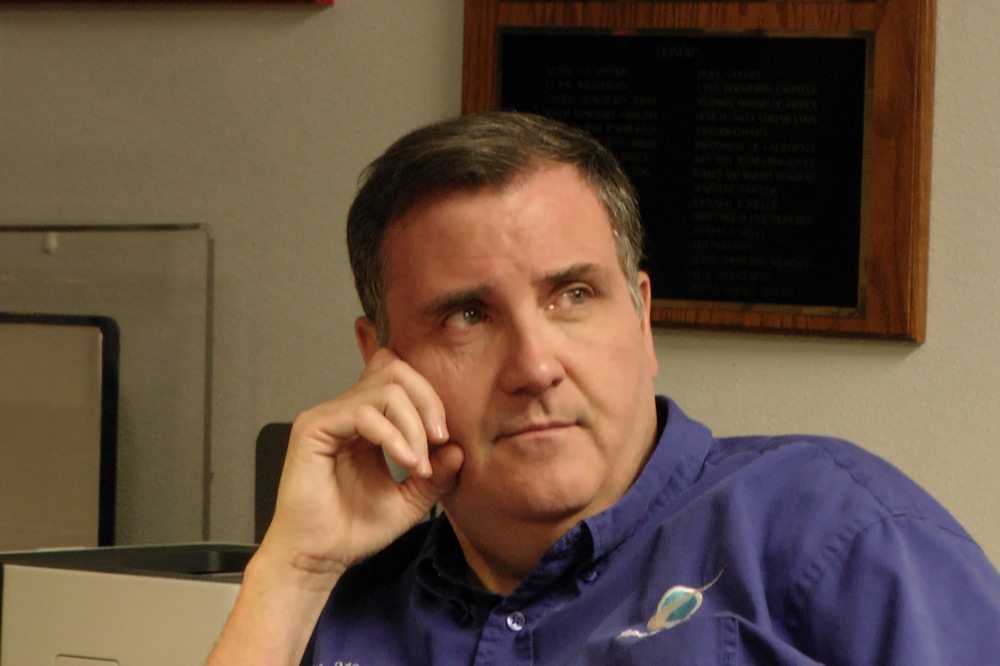
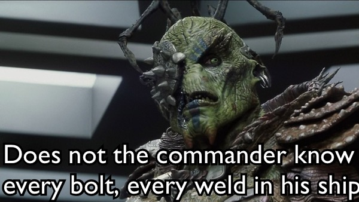

I make it no secret that I have a strange hobby. People are always either impressed, surprised, or confused when I describe to them what I enjoy doing in my spare time. It's not like it's that different from other hobbies which people have; some people make models of trains; some people made digital models of real-life systems.

I am making a futuristic starship simulator.

I mean make in a very loose sense. This is hardly my project, and I am hardly a contributor at all. But the small part I am playing is certainly an integral role in the process. So far, I've had a say in the software controls, the universe which the simulator will operate in, the lighting and sound system layout of the simulator set, and some of the custom hardware integration which we will be using.

I might be getting ahead of myself, though. I suppose I had better take a step back and explain the whole process from top to bottom.

This is Victor Williamson. Inspired by Star Trek, and seeing the benefits of simulated education early on in his career, he pioneered the concept of using science fiction simulations to teach Science, Technology, Engineering, and Math (STEM). Early on, he would do simple role-plays where his students would push paper buttons on cardboard boxes and he would react by narrating a story using his vast collection of false accents and an overhead projector. His first flights were recon missions to Mars where they would skim the surface, talking about the nature of the Red Planet. Students were interested, but not really excited. So he figured he would spice things up.

He had a Romulan ship attack them.

It worked. By adding in that bit of drama, the kids were suddenly glued to their chairs, their minds fixed on the simulation. He would go on to craft 'missions' like this one which revolved around a main story point, but also featured a prominent science topic: negotiating with the Romulans to go and study a Supernova; passing by a black hole and dealing with the relativistic effects; deciding what to do with an escaped slave who emerged from a wormhole. Adding the artistic elements (turning STEM to STEAM) helped to round out the missions and keep the kids interested. Lots of good fortune and several thousand dollars of grant money later, and a permanent simulator was built in his school's back lot.

And thus the Space Center was born.

The Voyager was built in 1990, the first of six ships built at Central School (the last of which was built in 2005). The image above is how the flagship looked shortly before it was shut down in 2012. For 22 years, this ship was the stage of space dramas teaching school kids teamwork, leadership, math, science, communication, responsibility, and decision making. It was a classroom, laboratory, and summer camp destination.

While the Voyager was open, the Space Center was also the central hub of a bustling volunteer organization. Hundreds of students impressed and inspired by the field trip experience on one of these ships would become even more involved. I was one of them.

I was so fascinated with the experience of the Space Center that I made no delay in beginning my work as a volunteer. I had come to the Space Center many times with my older brother, who was already a volunteer, and was blown away at what happened behind the scenes that I knew I had to become part of it.

I put in my volunteer registration papers in 2006, and began the process of observing and volunteering. I saw the control rooms, the skilled Flight Directors in charge of the flights (and which I always wanted to become), the supervisors assisting and monitoring the crews, the volunteers performing acting parts and running computer stations.

My brother, Brent, was a programmer, so naturally I would join with them. These programmers would meet at least weekly to work on the next cool computer terminal or software controlled gadget. The meetings were truly amazing. None of the members of this 'Programming Guild' were even out of high school, and yet every week there would be some new, amazing idea for something to put into a simulator. An integrated video system for creating video playlists for the missions; a fluid set of controls, which would allow you to put any screen on any computer; a sound effects player which integrated into the controls to react to what the kids were doing; a push server architecture. Some of these things would be discussed, even prototypes made. But none of us were skilled enough to be able to build it all. Over time, the programmers moved on to bigger and better things, leaving me as the lone remnant of that guild.

I eventually did reach my dream of becoming a Flight Director, and found it to be one of the most fulfilling and powerful experiences of my life up to that point. As Flight Director, I was in charge of representing the Space Center to the students who came. I would brief them on their mission, train them on how to use the simulator, launch them into space, play the role of all the aliens they came in contact with, play the mood music and sound effects and video and tactical view screens and interact with their computer stations and direct my volunteers and actors to do the various things which they needed to do... it was a lot of work. But in addition to doing all those things to put on a good show, I tried my best to remember that this was an educational venture (or EdVenture as we like to call it), so I mixed in the science, math, and social studies as much as possible.

I also became a full-fledged programmer, and started working on creating new simulator controls. One by one, I re-programmed each of the Space Center simulators (excepting the Voyager) using the new Revolution programming environment. Many of the ideas which were first brought up in the programming meetings were implemented in these controls. Truth be told, though, they were buggy and not entirely functional. There was so much more that they could be, given time, resources, and experience.

When the former Set Director, or simulator manager, of the ship I ran left on a mission to Korea, I was placed in charge. Suddenly I was responsible for an entire starship simulator. In the weeks following, me and my co-director Bracken Funk did some major modifications and renovations to the ship. I tore that ship apart and put it back together, learning how it worked.

I learned how the networking ran through conduit, and I even pulled my own cables through to set up a phone in the front of the ship. I learned how the audio inputs fed into the mixer, which fed into the amp which ran out to all the speakers, and I even added a few more speakers to the mix. I learned how the video systems converged to two switcher boxes, and the output of those ran to the main view screens on the ship, and then, out of necessity, learned how to set up a RGB Component video system (it had a funny glitch, though, where the signal would cut out whenever you switched inputs, returning after a few seconds of blackness). I did some custom electrical wiring to create a smoke machine timer, a transporter light, and a strobe light spark effect. This little ship pushed the boundaries of what kinds of effects we could pull in simulators.

Also, working off of the groundwork laid by my brother, I installed a DMX (computer controlled) lighting system in the Galileo simulator. This allowed the lights to be turned on, off, switched from red to white, and shaken (during an explosion) with the mere push of a button. This was an exciting time.

I left the Space Center officially in August of 2011 when I moved to Provo to attend BYU. I knew that I wouldn't have the means necessary to be coming to and from the Space Center to program and fix bugs, and I needed to let my successor get his feet wet without me hovering behind him. I left on my mission in January of 2012.

August of 2012 brought the closure of the Space Center by the Alpine School District for renovations. By October, there was no sign of the Space Center ever re-opening and a political campaign was founded to fight the District's decision and bring the Space Center back. This campaign was successful to an extent. In time, the District caved and began to perform the necessary remodeling. However, the original Voyager simulator (by far the most impressive and attractive of the five) was deemed too much of a hazard to be retrofitted, and was closed permanently.

I got the chance to see the Voyager after I got home from my mission. It was hardly a shell of it's former glory. Dust was everywhere; random implements were strewn all over the place. The desks, void of computers, revealed the plywood which was concealed within. I remembered going up those spiral stairs, exploring the Captain's loft, working from the Engineering platform or sleeping in the bunks on Deck 2. Now all of those things were either gone or boarded up. Nothing was left except memories.

During this time, Victor, who had been director of the Space Center from when it opened to when it closed, moved from Central to another elementary school, and eventually retired completely. Not too long afterward, though, he was approached by Renaissance Academy, a charter school in northern Utah County, and asked if he wanted to make a space simulator for that school. He accepted.

Since then, a group of Space Center volunteer alumni have joined together to create what we call the Farpoint Creative Team. This team is a band of some of the Space Center's skilled and talented volunteers who have gone on to get degrees and training. Helping to construct this new simulator is our way of giving back.

It's remarkable who we have on the team. Of course, Victor is the visionary leader and chief educator. We also have science fiction and astronomy experts; a data analyst, graphic designer, and expert flight director; an architect; an engineer; medical professionals; and programmers (my brother and myself). All of us bring something unique to the table, and all of us together, pooling our resources, think we'll be able to make the most impressive, most immersive experience ever. Not only that, but also an environment where learning will happen organically.

There was a little bit of debate about what we were going to call the new ship. Vanguard was a name that was sticking for a time. However, much to the approval of the team as a whole, we decided on something better.

The new ship will be called Voyager.

Cheers!
