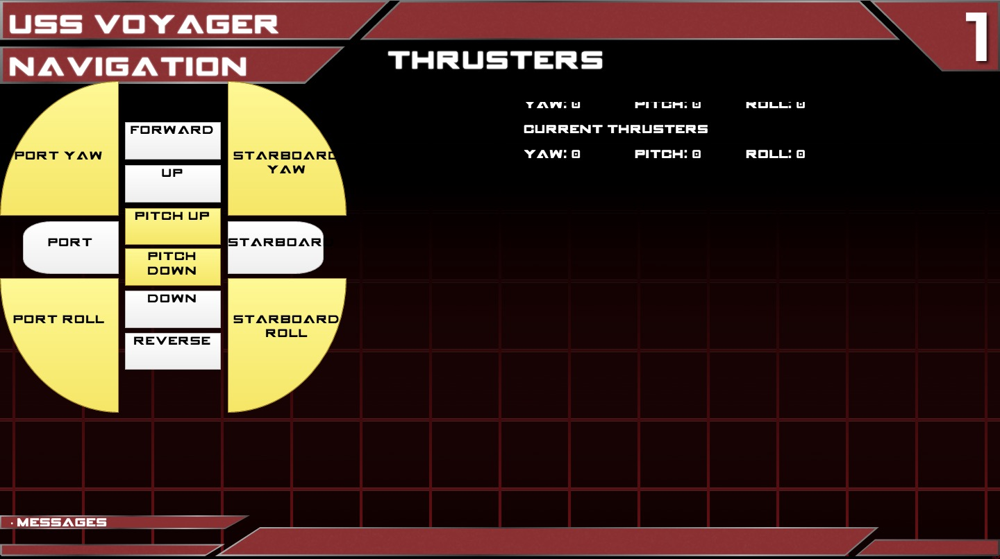
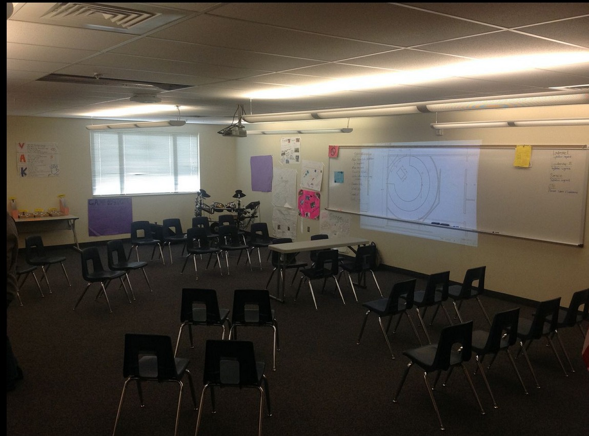
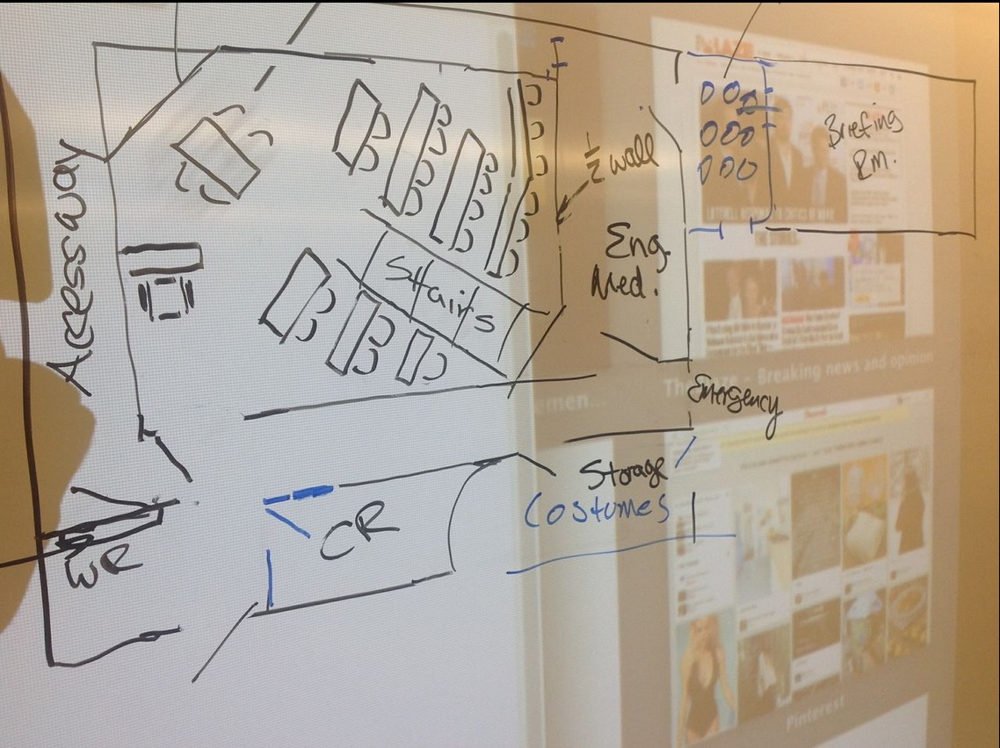
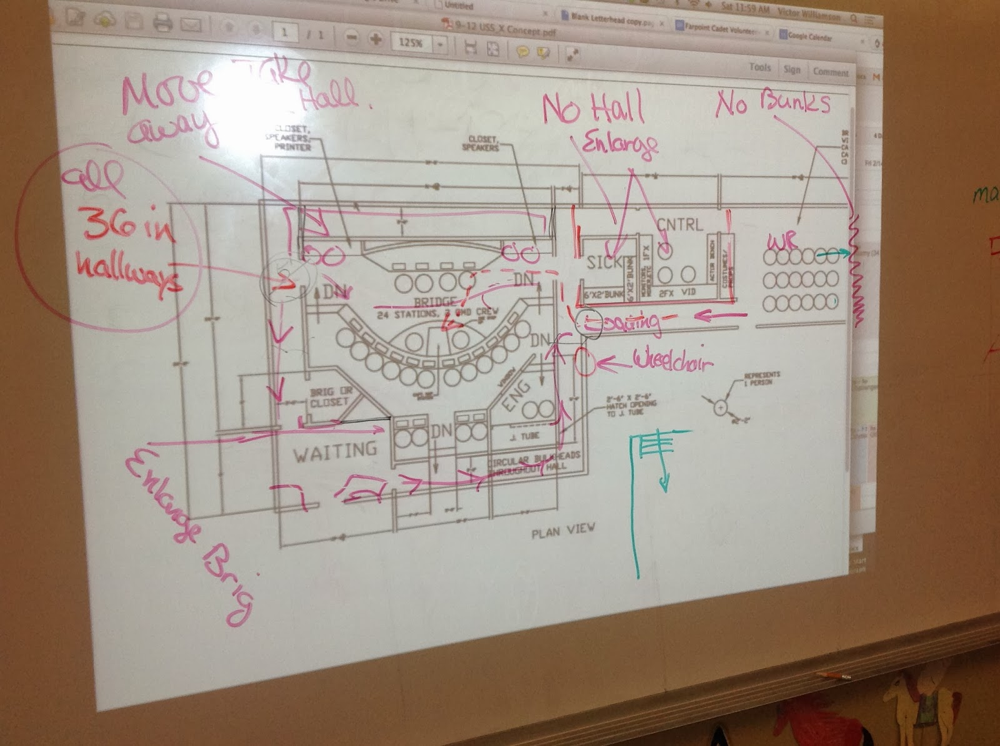
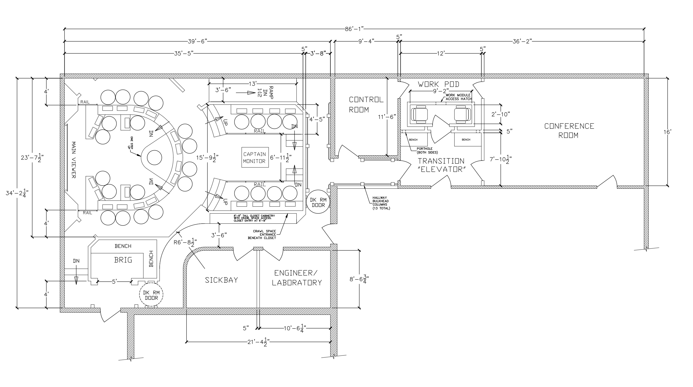
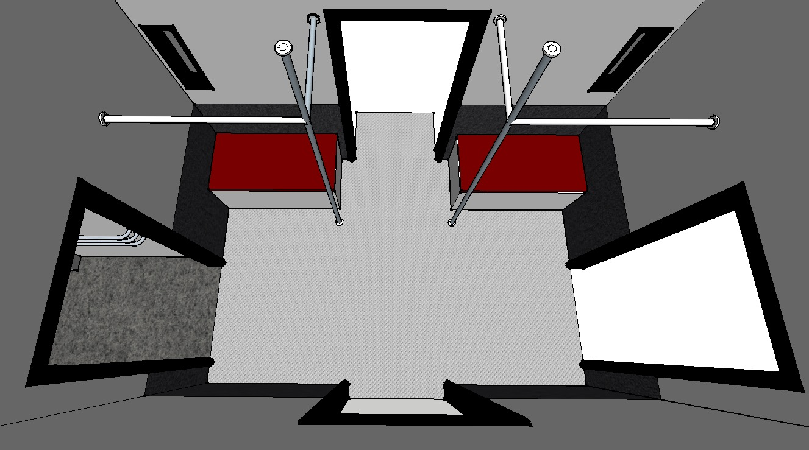
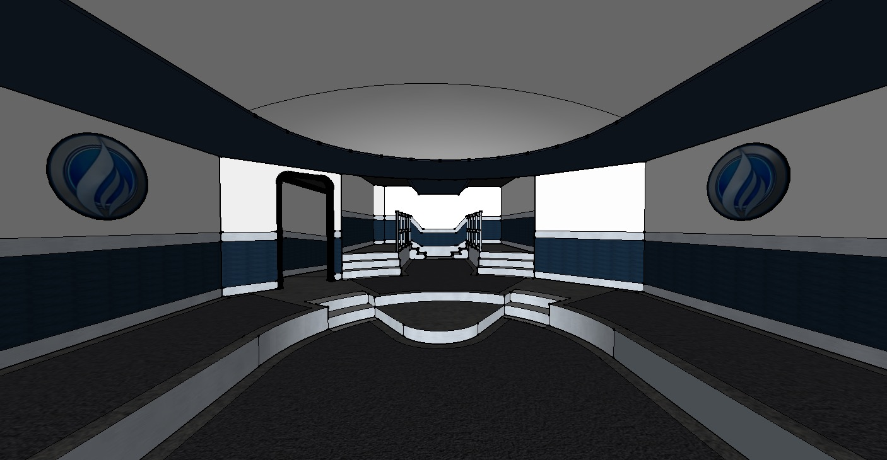

[Part 1](/how-to-build-a-space-ship-part-1-the-background)
Fair warning: What follows is going to be incredibly technical, especially towards the end.

I joined the Farpoint Creative team on accident almost. I was home from my mission for one short week before I got the itch to return to flying space ships. Even more surprising was my desire to program again - I didn't think it would be something I ever wanted to do again.

My brother had told me a lot about the new controls which he was building for this new simulator which was being constructed. He called his controls framework 'Flint', and it was designed to be a complete software solution to everything in a space simulator. The whole system was designed to be modular, allowing you to add or remove screens, stations, utilities, and functions as needed. It also meant that adding new functionality was as simple and making the one isolated package and including it with the rest of the system.

Flint is built on some cutting-edge software which was hardly even dreamed of when I had left on my mission, let alone being a reality. Now, all of the things which I had always wanted as a flight director were at my fingertips: Software controlled lighting, sound effects, audio, music, video, and other effects were now all possible; the ability to redistribute the entire simulator on the fly; controls which could be added to and improved over time, part by part; blazing-fast 3d animations. All of that is only the beginning.

And, of course, my beginning was a pretty far cry from all that. The first screen which I programmed for Flint was the Thrusters - a direct copy of the old Voyager's controls. You press a white button and you move in a specific direction; the yellow buttons rotate the ship. It took me a little while to actually program the screen. I had hardly touched Javascript (the language Flint is written in) before my mission, and the new framework had a bit of a learning curve. In the end, though, I had a completely functional thruster card.

This was just the beginning.

My work was eventually noticed by the rest of the team. I had begun tagging along to Space Center board meetings with Brent, my older brother, and during one meeting I showed off some of the things which I had developed. Vic invited me at that point become a full-fledged member of the creative team.

<iframe width="800" height="450" src="https://www.youtube.com/embed/7TYJyCCO8Dc?t=21s" frameborder="0" allowfullscreen=""></iframe>

Ever since the close of the original Space Center and Victor being brought on to Renaissance, the goal has always been to build a new simulator. This wouldn't be like the simulators of the past, though. It would be designed from the ground up for one main purpose: long duration missions. These serial missions would last months at a time, and focus on experimentation, experiences, and learning.

The simulator would also replace one of the computer labs, and as such would need to be usable and accessible during the day. All of the building code violations which closed the original Voyager simulator were taken into account, with specific consideration being given to accessibility for disabled students.

I remember some of the first creative meetings I went to were focused on architectural plans for the new simulator. Alex Debirk, a structural engineer and long-time flight director, had a few different versions of simulator plans, each with its own flair and style. His designs were limited by the space which was offered by the school and the number of students (26) which the room had to accommodate This only left a few options for placement of the bridge and control room areas.

Naturally, the best way to design a room is to case it out yourself.

This was one of the original designs which was discussed. This particular design took advantage of the massive space left over from the room which the ship would occupy. It included a separate sickbay and engineering room just off of the bridge, had a small brig, converted the classroom on the far right side into a briefing and conference room, took advantage of the exterior door with a waiting area, and was filled with hallways; perfect for alien invasions. Several different configurations of the main bridge were considered. However, it was eventually deemed to difficult to build. It would have required massive construction costs including demolition of several walls and two entire rooms.

The objectives were changed to include leaving as much of the original construction as possible, with limited demolition. This drastically changed the designs, limiting what was capable in the space provided. However, Alex worked his magic and came up with this:

This is the final layout which was decided on, incorporating many of the positive aspects of the original design: Sickbay and Engineering are separate rooms, now located on a separate deck accessible through 'turbolifts.' The bridge has two separate possible entrances, allowing for multiple invasion vectors. The brig remained; the briefing room remained. The waiting area had to be nixed, but in exchange for that, a special, multi-purpose transition room was designed. Inspiration was drawn from subway cars. This 'transpod' is meant to act as a space elevator, shuttle craft, and crew teleporter, essentially a 'room of requirement' for getting the crew wherever they need to go. The hanging bars were an absolute must.

The hallways were spiffed up with full-height bulkheads along either side.

The bridge features curved front desks with two raised platforms on either side. Sadly, my picture omits the desk units. However, you can see the plans for a curved half-dome structure above the main portion of the bridge, which provides most of the lighting for the bridge through indirect light reflection. The captain's station is elevated, and in the far back is the Captain's Monitor (also not displayed). This is a table-top display which shows current tactical information, allows the captain to make plans, and features a multi-touch screen for drawing diagrams and interfacing with the computer.

The sickbay and engineering rooms are actually built into an existing storage room which is adjacent to the simulator, which adds both convenience and cost-savings.

An additional bonus is the inclusion of a 'Workpod' room, a special storage space dedicated to a mobile transport pod which the crew will be able to use to repair and upgrade their ship.

With the general plans in place, it was time to get to work on the more technical aspects of the ship. While every member of the team had invaluable contributions to every aspect of the simulator, I'll focus on the parts which Brent and I directly affected.

We took responsibility for anything which carried a low-voltage data signal, namely sound, computers, camera surveillance, video, effects, and lighting control. I'll touch on some of the decisions we made for each of these.

## Sound

This ship is one of the most unique as far as sound goes. Unlike any other ship, it has multiple zones which each need to be able to play different sounds at different times. In addition, there need to be microphones placed in each of these separate places to ensure that the staff can hear what is going on there.

The first challenge was figuring out a way of taking a certain number of inputs (such as music, sound effects, ambiance, and microphone input) and sending them to different outputs (such as the main bridge, the hallways, the briefing room, or the sickbay and engineering rooms). As it turns out, this isn't as easy as one would imagine.

Fortunately for us, a brand-spankin'-new (read July 2014 new) digital audio deck hit the shelves, and it has all the features we could ever need. It takes all the inputs and outputs we could want and route them wherever we tell them, has an onboard DSP for equalizer and audio effects, and is completely computer controllable. That means that all of the audio can be manipulated through Flint.

Imagine for a moment that the communications officer is making an external call. Instead of a phone system, the comm officer will have a headset hooked into the sound system. They will talk with someone in the control room over that headset. However, the instant they transfer that call to main speakers, the audio deck will switch the output from the comm officer's headset to the main bridge speakers, and they will instantly be talking to everyone.

Or, the captain presses a button on his chair controls - "Bridge to Engineering". Without hesitation, the bridge audio will be connected to Engineering, and the captain will be talking to Scotty, and vice versa. The possibilities are limitless.

Another challenge which was apparent was whether to do a passive or active speaker system. Passive is what most people think of when they hear about a sound system - all inputs route to an amplifier which then sends the powered signal to each of the speakers. However, for a ship with as many audio zones as we have, you would need at least 6 amps, which adds up quickly.

Instead, we opted for an active speaker system, one in which all of the speakers already have amplifiers inside of them - all you do is send signal directly to the speaker and it cranks it out for you. This way, instead of getting separate amps, we just send the signal straight from the audio deck to the speakers, cutting down on cost and complexity. Subwoofers will be placed underneath the raised floor of the bridge, allowing for sound to reverberate through the entire simulator.

Also, as I mentioned, headsets will be the way to go in this ship. There will still be a speaker and handheld microphones in the control room, but the flight director will also be able to use a personal headset, programmed to hear only what the flight director wants to hear and to speak only where the flight director wants to. This will provide additional flexibility to the flight director.

## Cameras and Video

All camera and video data is being transmitted over Cat5e cable, simplifying the simulator extensively. The cameras are IP-PoE, which allows us to place them anywhere we want and access them from any computer. We also have talked about installing a new DVR and overhauling the entire schools camera system to run along side our cameras.

The video system is HDMI over Cat5e, mainly for simplifying our cable runs. Instead of using DVD players, this simulator will have its own dedicated video computer powered by Flint. Clips will be stored and then cued up based on which mission the simulator is doing. This also provides the flexibility for dynamic tactical cards - since everything is connected to Flint, tactical cards which are pertinent to the situation can be displayed (shields, communications, etc.) Also, the cameras are linked in too, which means that the captain and engineer could have both an audio and video conversation. In fact, the Flight Director could even get in on the conversation too with some special technologies which we are currently developing.

## Lighting and Effects

DMX512 (Digital Multiplex) is the industry standard for theatrical lighting. It allows you 512 channels of lighting control, each channel with its own dimmer capable of being set to any value from 0% to 100% intensity. Magellan and Galileo use DMX lighting, both computer controlled.

Lighting in previous Space Center ships consisted of large panels of lighting controls with manual dimmers (for shaking the lights during explosions) and switches for changing between red lights and white lights (or blue, if you are the Phoenix). The lights themselves were incandescent can lights (or CFLs in the Magellan), tinted either blue or red for the accent lights. Some of the newer ships, such as the Odyssey II or some DSC ships, use RGB tape light, controlled via remote control. These tape lights have separate colors for red, green, and blue (combining them creates white light), and theoretically can produce any color of the spectrum. However, being remote controlled made them laggy and slow and limited the possibilities of color production. The lighting we chose was controlled by a DMX driver, meaning lighting changes are instantaneous, computer controlled, and each channel (red, green, and blue) and be set to any intensity individually, creating 16 million possibilities of color.

We opted for doing a system with RGB LED strip lights in addition to bright RGB PAR can fixtures to act as spotlights. Believe it or not, it's really difficult to find cans which have the certifications necessary to be installed in a permanent location. Through our perusals of the internet, we managed to find something which was similar to our tape lighting, but in a retrofit can structure - basically designed to take the place of a normal can fixture in a home. Go figure, though - it wasn't certified.

We continued our search until eventually we came across the mother-load; an RGBAW+UV PAR Can. Yep, you read that right: Red-Green-Blue-Amber-White+Ultra Violet. That's six different types of LEDs which fit into this thing. Not only that but they come in two sizes, are 100% computer controllable, super bright, and individually addressable. Oh, and best of all: they are CE certified. We're right now exploring what kinds of effects we can do with lights this beefy.

## Effects & Interaction

Since the world has gone the direction of IoT (Internet of Things, or internet connected toasters), the capabilities of having human-computer interactive elements has gone through the roof. Our abilities for having real-time physical feedback for certain user interactions.

Take, for example, the brig. In the old Voyager, there was just an array of fluorescent blacklights, switched from the control room, indicating a force field. The security officers would have special sashes which allowed them to walk through the force field with anything they might have been carrying. To get though the field, you have to have a sash. However, the lights remained on whenever anyone stepped through them - there was no indication that the forcefield did anything.

In the new ship, we are going to be placing a Raspberry Pi microcomputer in the wall adjacent to the brig. Connected to it will be an RFID (Radio Frequency ID, or micro ID - they put these things in credit cards and your pets) reader and a camera. The RFID reader will be programmed to detect specific RFID which will be sewn into the two security sashes in the new security uniforms. To enter the brig, security will have to badge the scanner to deactivate the force field (since the brig lights are computer controlled, it will be totally automatic). A sound effect will play as the forcefield dims. They can then throw the bad guys in, badge again, and the force field will flicker back to life.

What if someone breaches the forcefield? Well, that's what the camera is for. It will be constantly scanning to see if there is someone or something in the way of the forcefield. If it notices something in the path, it sends a signal to the brig, which will play a sound effect and flicker, as if the force field was aggravated. That should be enough of an effect to keep someone from stepping through.

Engineering panels throughout the ship will also interface with the main computer systems in various ways. Power conduits which affect the lighting, a set of self-destruct buttons which must be pushed simultaneously to work properly, video conferencing; The point is that we can connect just about anything we want to the system and, with the right code in place, it will just work.

---

So, that's the gist. Granted, all of this has come about after months of planning, tinkering, thinking things through, and discussing options, in addition to hours of research and development. This ship is going to be incredible, that's for sure. Stay tuned! There's more coming.
Cheers!
