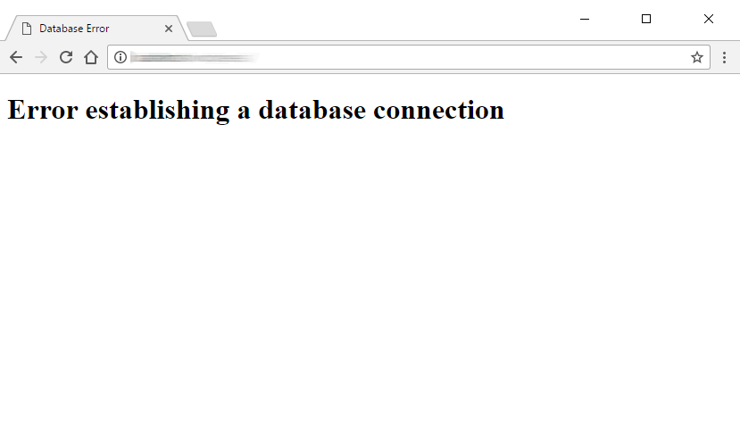

_This is a post in a series about code projects, open source, build tools, and deployment._

Can I tell you a secret? I run a (very) modest internet business distributing [spaceship simulator software](https://thoriumsim.com). Guess how much it costs me to run?

\$0.001

Yep, that's right. It's free. How can I get away with it? Three things:

1. I don't have a lot of customers, which means I don't have a ton of traffic or data storage needs.
2. I run all of my websites on static file hosts, which have a very generous free tier.
3. I run all of my server-side code as serverless functions on providers that have very generous free tiers.

Today's post will focus on the second item in that list. A future post will cover serverless functions.

## What is Static Hosting?

If you are old enough to remember the Good Old Days™ of web development, back when Wordpress wasn't a thing and websites weren't interactive, you would also remember the humble HTML file. The basic building block of a website, the HTML file is what defines the content of your site. Couple that a simple stylesheet and maybe a bit of JavaScript to add some simple interactions, and you've got a full-blown webpage. Link those HTML files together, and suddenly you have a website, with linked pages. These HTML files are static, because they never change (unless the developer specifically changes them).

That wasn't enough, though. Dynamic websites, authentication, and user-generated content necessitate server-rendered websites; that is, sites where data from a database is placed into a template and then sent to the web browser. This is a dynamic page - it might be at the same URL, but the content might be different based on the user-generated content, user authentication, or any other number of factors. Think of sites like Facebook, Instagram, or Ebay.

## What's wrong with Dynamic Websites?

Dynamic websites are great, and definitely necessary when you have a lot of rapidly changing content, like the picture posts from Instagram or search results on Google. Nifty!

I specifically mentioned Wordpress because it made dynamic sites easy to set up for anyone! All you need is a webserver that runs PHP and MySQL - both free and open-source. However, web hosting isn't cheap, especially depending on how much traffic you have. Also, your precious website could easily be DDoS'd if a blog post happens to make the front page of Reddit and you get a lot of unanticipated traffic.

<small>Who enjoys these guys?</small>

Does your blog really need to be dynamically hosted? The content of the blog probably changes a few times a week, at most. Maybe a bit more often if you have comments, but if you don't have comments then what is the point of dynamic hosting?

## Static Hosting Benefits

## Static Hosting Providers

## What about Dynamic Stuff?

<small>1 I mean, yes. It costs me a bit for the business license, a bit for hosting every year. But as far as variable costs go, it's basically free.</small>
